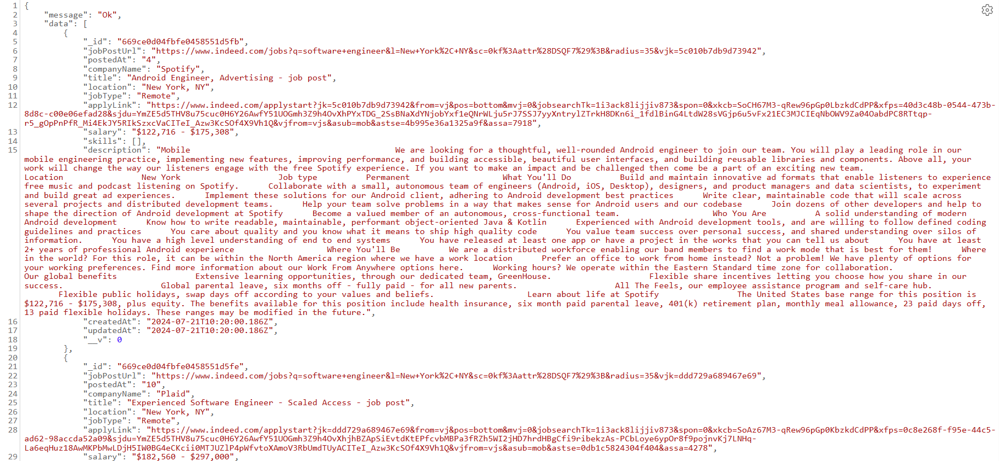

# LinkedIn Job Scraper with Bright Data and Next.js

This is a Next.js project that uses Bright Data's Web Browser API to scrape job listings on LinkedIn and store them in a MongoDB database.

LinkedIn may have changed the classname of certain elements. In this case, one will have to manually change the selector classname to ensure the correct content is scraped.

**Note**: Sometimes when calling the API POST /api/cron/scrape, Puppeteer is not be able to find the HTML element with the class name '#mosaic-provider-jobcards' (the HTML element that holds all the jobs in a page), in this case after the timeout period (1 second), the application will throw an error and inform that the timeout has been exceeded. When this happen, simply rerun the application to scrape again. 

## Prerequisites

Ensure you have the following installed:
- **Node.js** installed on your machine
- Follow the format in `.env.example` and include your own MongoDB and Bright Data credentials

## Technologies Used
 
- Next.js (Used for API routes)
- Puppeteer
- Bright Data Web Browser API
- Mongoose
- MongoDB
- Docker
- Typescript

## Getting Started

1. __Clone the repo:__ `git clone https://github.com/jma52799/job-scraper.git`
2. __Install libraries:__ `npm install`

Then, run the development server:

```bash
npm run dev
# or
yarn dev
# or
pnpm dev
# or
bun dev
```

Open [http://localhost:3000](http://localhost:3000) with your browser to see the results of GET requests.

## API Endpoints

- **GET /api/jobs**: Returns all job records from the database.
- **GET /api/jobs?results={INTEGER}**: Returns the specified number of records. If the requested amount exceeds the number of records in the database, all records are returned.
   - For example, to retrieve 10 records: **GET /jobs?results=10**
- **POST /api/cron/scrape**: Scrapes job listings from LinkedIn and stores them in the database (only if it's not a duplicate of an existing record).

## Results Snapshots

- **GET /api/jobs**


- **GET /api/jobs?results=500**


- **POST /api/cron/scrape**

